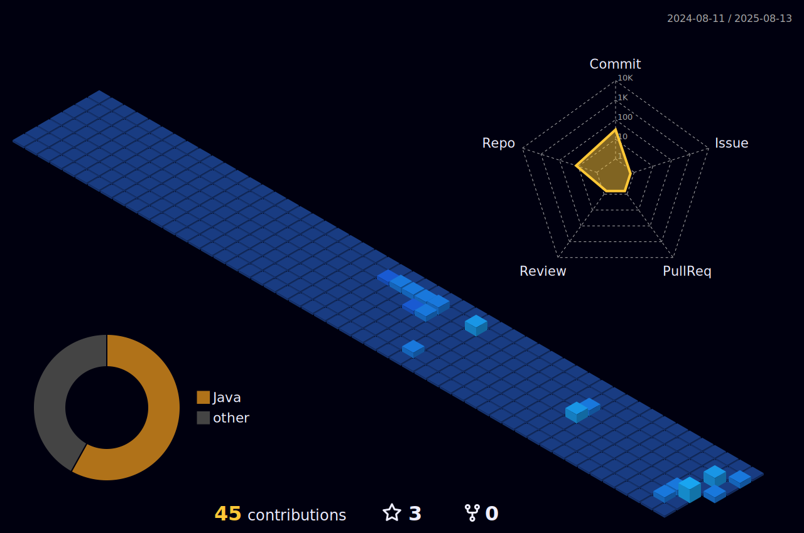

<h1 align="center">Gabriel Luciano</h1>

  Desenvolvedor · Estudante de TI 

---

---

## Sobre

- Estudante de Desenvolvimento de Sistemas no SENAI
- Em formação na área de tecnologia, com foco nos fundamentos de programação, lógica e desenvolvimento de software
- Buscando adquirir experiência prática e ampliar conhecimentos em linguagens de programação, banco de dados e desenvolvimento web
- Interessado em aprender sobre criação de interfaces, automação e boas práticas no desenvolvimento de sistemas

## Contato

- [LinkedIn](https://www.linkedin.com/in/gabriel-luciano-32380a349/)
- [Portfólio](https://professorcorrea.com.br/)
- [Instagram](https://www.instagram.com/luci4n0.m3lo/)

---

> "A educação é a arma mais poderosa que você pode usar para mudar o mundo." - Nelson Mandela 
